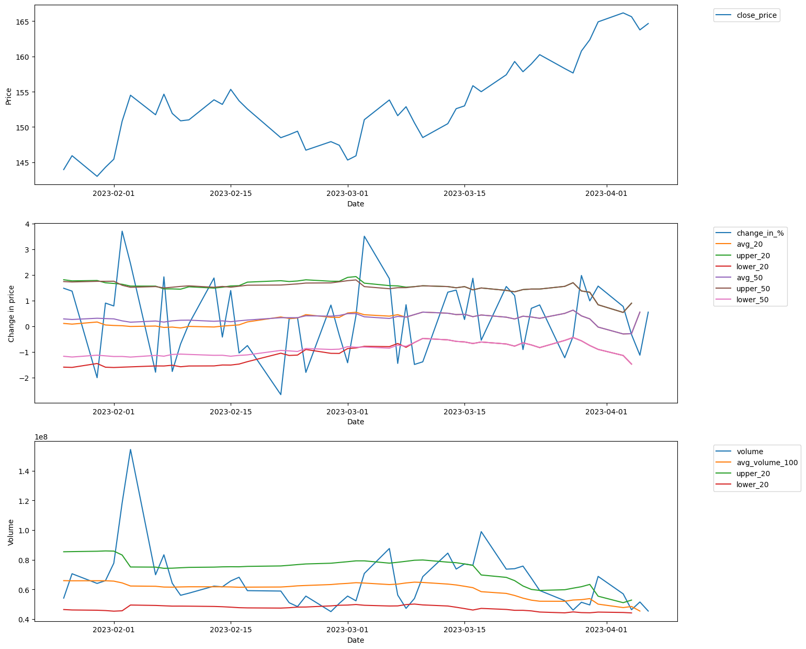

# stock-data-pipeline

For DE-course work; Project

## Problem of interest

**Was today an outlier?**
- wrt 20_day_price_change						
- wrt 50_day_price_change
- wrt 50_day_volumne (higher side only)
- wrt 100_day_volume (higher side only)
- wrt 200_day_volume (higher side only)


## POC: APPLE:NASDAQ


Souce: experiments/POC_MODEL.ipynb

# Project design
[TBD]

# Steps to Reproduce and test this repo

### Dependencies

Following are list of dependencies 
1. Terraform (for IaC) connecting to Google Cloud 
2. Docker to run pipeline 

### Steps

1. Clone the repro 
2. Inside `price_n_volume` folder lies our pipeline 

   Create an envoirment variable storing your Google Cloud Credentials like below

   ```shell
   export GOOGLE_APPLICATION_CREDENTIALS="<path/to/your/service-account-authkeys>.json"
   
   # Refresh token/session, and verify authentication
   gcloud auth application-default login
   ```

   ```bash
   $ terraform init # <-- Enter Google Project ID whenever quried
   $ terraform plan # <-- Enter Google Project ID whenever quried
   $ terraform apply # <-- Enter Google Project ID whenever **quried**
   ```

   This would create
      1. A google cloud bucket with name: `lake_price_n_volume`
      2. A dataset with name `prod_price_n_volume`

3. Start prefect orion server for checking various logs
   ```shell
   prefect orion start
   ```
4. [DEMO] Push data available in GCS bucket using 

   ```shell 
     export GOOGLE_APPLICATION_CREDENTIALS="<path_to_gcp_creds>.json"
     python push_to_gcs.py 
     python bq_pipeline.py # <-- This would create 'recent_outliers' table in your dataset
   ```

5. [COMPLETE_PROJECT]  
   ```
   echo '{"alphavantage": "B9367TAXK4ZMYQVI"}' > api_key.json
   python get_nasdaq_n_nse.py # this would generate a data folder.
   export GOOGLE_APPLICATION_CREDENTIALS="<path_to_gcp_creds>.json"
   python push_to_gcs.py # data folder pushed to gcs 
   python bq_pipeline.py # gcs to bq
   ``` 
6. [DOCKERFILE] TBD

7. [DATA_ANALYTICS BOARD PDF](Price_n_Volume_outlier.pdf)
   1. As GCS credits expired, live dashboard cannot be shared

# References

1. [Stats: Outlier Detection](https://www.analyticsvidhya.com/blog/2021/05/feature-engineering-how-to-detect-and-remove-outliers-with-python-code/)
2. Alphavantage: API Key added in a git ignore file
3. RapidAPI: best stock API: https://rapidapi.com/blog/best-stock-api/
4. TwelveData1: https://rapidapi.com/twelvedata/api/twelve-data1/pricing
   1. https://api.twelvedata.com/time_series?symbol=TCS:BSE&apikey=your_api_key
   2. **Indexes via TwelveData1**